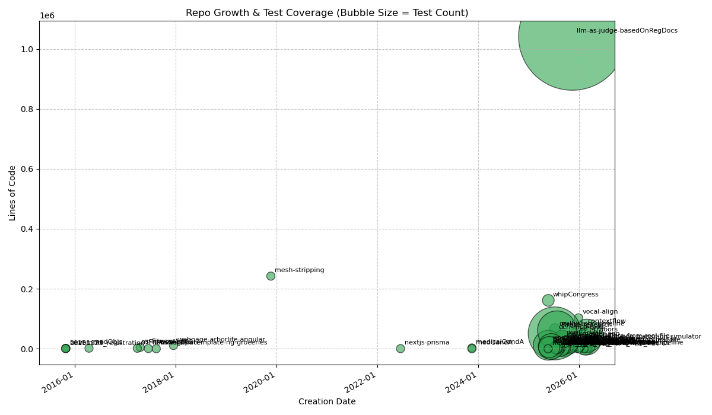

## Hi there 👋

<!--
**sagearbor/sagearbor** is a ✨ _special_ ✨ repository because its `README.md` (this file) appears on your GitHub profile.

Here are some ideas to get you started:

- 🔭 I’m currently working on ...
- 🌱 I’m currently learning ...
- 👯 I’m looking to collaborate on ...
- 🤔 I’m looking for help with ...
- 💬 Ask me about ...
- 📫 How to reach me: ...
- 😄 Pronouns: ...
- ⚡ Fun fact: ...
-->

<!-- LOC_START -->
### Codebase Visualization

| Repo | Created | Stack | Files | Tests | LOC |
|:---|:---|:---|---:|---:|---:|
| megaCity-rotating | 2026-01-11 | JSON, Markdown, React, TypeScript | 33 | 0 | 10,288 |
| VaxInsight | 2026-01-07 | HTML, JSON, JavaScript, Markdown, React, TypeScript | 19 | 0 | 5,059 |
| ml-assets | 2025-12-29 |  | 1 | 0 | 2 |
| vocal-align | 2025-12-28 | Dart, Gradle, HTML, JSON, JavaScript, Markdown, Python, XML, YAML | 248 | 2 | 102,454 |
| sagearbor | 2025-12-22 | Markdown | 1 | 0 | 63 |
| ai-ubi-wellbeing-transition-simulator | 2025-12-21 | HTML, JSON, Markdown, React, TypeScript, YAML | 60 | 0 | 19,143 |
| llm-as-judge-basedOnRegDocs | 2025-11-13 | Bourne Shell, CSS, CSV, Dockerfile, FastAPI, HTML, JSON, JavaScript, Markdown, Python, XML, YAML | 3,024 | 3,025 | 971,125 |
| cc_starter_repo_with_agents | 2025-11-06 | Markdown | 7 | 0 | 973 |
| repo-to-video | 2025-10-31 | Bourne Shell, Markdown, Python, YAML | 54 | 36 | 6,435 |
| env-banner-node | 2025-10-16 | HTML, JavaScript, Markdown | 7 | 0 | 785 |
| env-banner-python | 2025-10-16 | Django, FastAPI, Flask, HTML, Markdown, Python | 22 | 0 | 2,119 |
| context-aware-ai-training | 2025-10-14 | Bourne Shell, DOS Batch, Markdown, Python | 27 | 20 | 4,425 |
| mindshift | 2025-10-06 |  | 10 | 0 | 68 |
| test-llm-apis | 2025-09-29 | Bourne Shell, HTML, JSON, JavaScript, Markdown, YAML | 43 | 0 | 14,061 |
| api-tests-dcri | 2025-09-23 | Markdown, Python | 9 | 4 | 1,281 |
| ghCreate-mockData-from-real-file | 2025-09-22 | Bourne Shell, CSS, Dockerfile, FastAPI, HCL, HTML, JSON, JavaScript, Markdown, Python, YAML | 57 | 61 | 10,405 |
| git-scan | 2025-09-19 | Markdown, Python | 3 | 0 | 523 |
| taskmaster-app | 2025-09-17 | C++, CMake, Dart, JSON, Markdown | 169 | 0 | 30,865 |
| schedule-assessments-optimizer | 2025-09-11 | Bourne Shell, JSON, JavaScript, Markdown, Python, TypeScript | 66 | 38 | 9,204 |
| secure-dev-tools | 2025-09-11 | Bourne Shell, Dockerfile, Markdown | 19 | 0 | 668 |
| RWE-planner | 2025-09-10 | Bourne Shell, CSS, JSON, JavaScript, Markdown, Python, YAML, make | 43 | 43 | 3,257 |
| protocol-assistant | 2025-09-10 | Markdown | 2 | 0 | 307 |
| dcri-gpt | 2025-09-09 | CSS, INI, JSON, JavaScript, Markdown, Python, TypeScript, YAML | 111 | 166 | 15,504 |
| Create-mockData-from-real-file | 2025-09-06 | Bourne Shell, CSS, Dockerfile, FastAPI, HCL, HTML, JSON, JavaScript, Markdown, Python | 112 | 74 | 22,143 |
| dcriCTdash | 2025-09-02 | Markdown, PowerShell, Python, TOML, YAML | 152 | 68 | 33,295 |
| data-analyzer | 2025-08-21 | Bourne Shell, JSON, Markdown, Python, Streamlit, YAML | 58 | 93 | 12,268 |
| csvChecker | 2025-08-19 | JSON, Markdown, Python, Streamlit, YAML | 25 | 68 | 3,227 |
| dcriCrawl | 2025-08-17 | Markdown, Python, Streamlit, YAML | 25 | 8 | 785 |
| concatGitFiles | 2025-08-16 |  | 3 | 0 | 90 |
| chatnbook | 2025-08-11 | CSS, HTML, JSON, JavaScript, Markdown, PHP, Python, SQL, TypeScript, YAML | 297 | 18 | 20,113 |
| dcri_ai_Azure_home | 2025-08-04 | CSS, HTML, JSON, JavaScript, Markdown | 7 | 0 | 946 |
| Medschool_ArborTester | 2025-08-03 | INI, JSON, JavaScript, Markdown, Python, YAML | 60 | 26 | 9,785 |
| multiAgent_AgileTeam_Start | 2025-08-02 | Markdown, Python | 21 | 3 | 1,635 |
| PIrate_research | 2025-07-24 | Bourne Shell, FastAPI, HTML, JSON, Markdown, PowerShell, Python, TOML, YAML | 223 | 424 | 61,468 |
| worktime_bot_survey | 2025-07-19 | Flask, HTML, JSON, Markdown, Python, YAML | 58 | 28 | 3,792 |
| workweek_survey | 2025-07-19 | FastAPI, HTML, Python, YAML | 25 | 15 | 828 |
| oralhistory_timeline | 2025-07-11 | Bourne Shell, CSS, FastAPI, HTML, JSON, JavaScript, Markdown, Python | 119 | 14 | 65,900 |
| dcri-mcp-tools | 2025-07-08 | Bourne Shell, Flask, HTML, JSON, Markdown, Python, YAML | 234 | 808 | 51,205 |
| clinicalTrials_s2f | 2025-06-12 | FastAPI, JSON, Markdown, Python, Streamlit, YAML | 59 | 175 | 7,487 |
| archiveProcessingAgent | 2025-05-29 | HTML, Markdown, Python | 77 | 113 | 5,081 |
| whipCongress | 2025-05-23 | FastAPI, JSON, Markdown, PowerShell, Python, Streamlit | 704 | 21 | 161,318 |
| clinical-trial-pvalue-explorer | 2025-05-22 | FastAPI, JSON, Markdown, Python, Streamlit, YAML | 58 | 242 | 11,600 |
| word-doc-chatbot | 2025-05-21 | Bourne Shell, FastAPI, JSON, Markdown, Python, Streamlit, YAML | 71 | 61 | 15,641 |
| healthU_BMI_test01 | 2025-05-21 | Streamlit | 2 | 0 | 32 |
| medicalQandA | 2023-11-16 | JSON, Next.js, React, TypeScript, YAML | 18 | 0 | 2,534 |
| medQandA | 2023-11-16 |  | 1 | 0 | 2 |
| nextjs-prisma | 2022-06-17 | CSS, JSON, Next.js, React, TypeScript | 14 | 0 | 390 |
| railwayDBs | 2022-06-17 |  | 0 | 0 | 0 |
| mesh-stripping | 2019-11-21 | CSV | 3 | 0 | 242,281 |
| webpage-arborlife-angular | 2017-12-15 | HTML, JSON, JavaScript, TypeScript | 30 | 0 | 10,927 |
| nsNegotiate | 2017-08-13 |  | 1 | 0 | 11 |
| nativescript-template-ng-groceries | 2017-06-16 | JSON, TypeScript, XML | 21 | 0 | 601 |
| nsFitnessApp | 2017-04-18 | CSS, HTML, JSON, JavaScript, Markdown, TypeScript, XML | 124 | 0 | 4,730 |
| nsFitnessApp02 | 2017-03-28 | CSS, JSON, JavaScript, XML | 22 | 0 | 1,537 |
| medObjs | 2016-04-12 | CSS, HTML, PHP | 15 | 0 | 1,834 |
| nevernote | 2015-10-28 | ERB, HTML, Ruby, SCSS, YAML | 50 | 0 | 831 |
| bluit | 2015-10-26 | ERB, HTML, Ruby, SCSS, YAML | 72 | 0 | 1,241 |
| 20151025_registration | 2015-10-25 | HTML, Ruby | 30 | 0 | 291 |

<!-- LOC_END -->